# RealTime StockStream

RealTime StockStream is a streamlined system for processing live stock market data. It uses Apache Kafka for data input, Apache Spark for data handling, and Apache Cassandra for data storage, making it a powerful yet easy-to-use tool for financial data analysis


## Getting Started

This guide will walk you through setting up and running the RealTime StockStream on your local machine for development and testing.

### Prerequisites

Ensure you have the following software installed:
- Docker
- Python (version 3.11 or higher)


### Todo Features

1. **Live Market Data Integration** ⌛
2. **Advanced Analytics Features** ⌛
3. **Interactive Data Visualization** ⌛
4. **Improved Scalability** ⌛
5. **User Customization Options** ⌛
6. **Stronger Security** ⌛


### Used Techs


- Appache Kafka
- Appache Cassandra
- Appache ZooKeeper
- Appache Spark
- Python


### Installation

Follow these steps to set up your development environment:

#### Setting Up Kafka

1. **Create a Kafka Topic**:
   ```bash
   kafka-topics.sh --create --topic stocks --bootstrap-server localhost:9092 --partitions 1 --replication-factor 1
   ```


## Suppored Data Opreations

1. **Grouping Aggregation:** Summarize data by groups.
2. **Pivot Aggregation:** Reshape data, converting rows to columns.
3. **Rollups and Cubes:** Perform hierarchical and combinational aggregations.
4. **Ranking Functions:** Assign ranks within data partitions.
5. **Analytic Functions:** Compute aggregates while maintaining row-level details.


## Database Schema

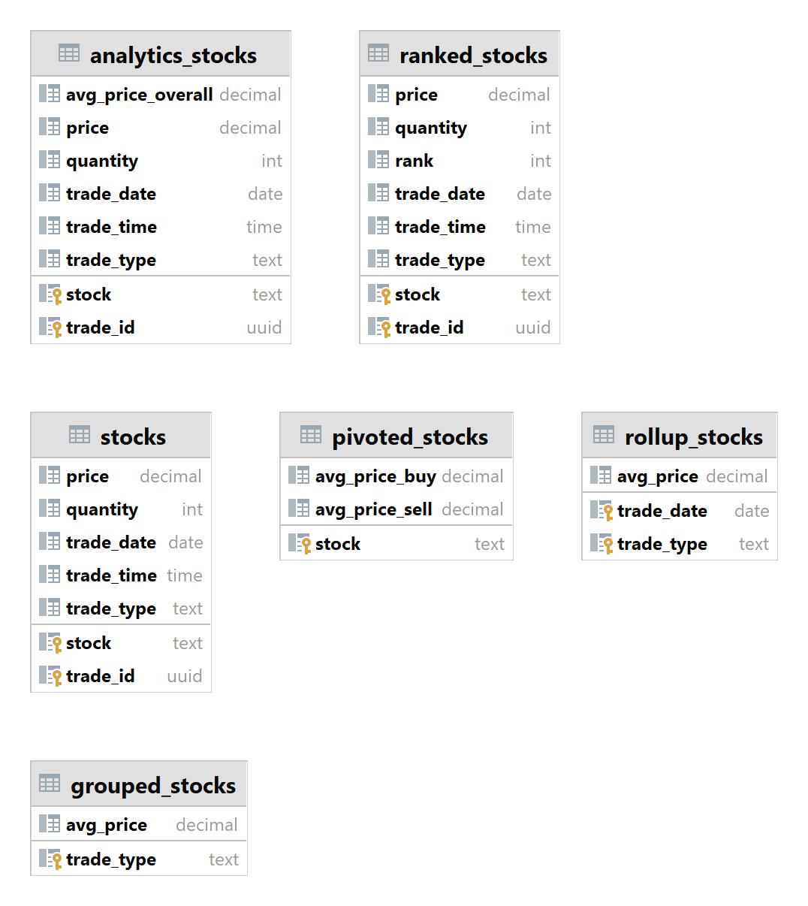

#### Configuring Cassandra

1. **Create a Keyspace and Table**:
   Execute the following CQL commands to set up your Cassandra database:
   ```sql
   CREATE KEYSPACE stockdata WITH replication = {'class':'SimpleStrategy', 'replication_factor' : 1};

   CREATE TABLE stockdata.stocks (
       stock text,
       trade_id uuid,
       price decimal,
       quantity int,
       trade_type text,
       trade_date date,
       trade_time time,
       PRIMARY KEY (stock, trade_id)
   );
   ```

## System Architecture


#### Docker Compose

1. **Launch Services**:
   Use Docker Compose to start Kafka, Zookeeper, Cassandra, and Spark services:
   ```yaml
    version: '3.9'
        services:
        zookeeper:
            image: bitnami/zookeeper:latest
            ports:
            - "2181:2181"
            environment:
            - ALLOW_ANONYMOUS_LOGIN=yes
            networks:
            stock-net:
                ipv4_address: 172.28.1.1
                
        kafka:
            image: bitnami/kafka:latest
            ports:
            - "9092:9092"
            environment:
            - KAFKA_BROKER_ID=1
            - KAFKA_CFG_LISTENERS=PLAINTEXT://:9092
            - KAFKA_CFG_ADVERTISED_LISTENERS=PLAINTEXT://172.28.1.2:9092
            - KAFKA_CFG_ZOOKEEPER_CONNECT=zookeeper:2181
            - ALLOW_PLAINTEXT_LISTENER=yes
            depends_on:
            - zookeeper
            networks:
            stock-net:
                ipv4_address: 172.28.1.2

        cassandra:
            image: cassandra:latest
            ports:
            - "9042:9042"
            volumes:
            - ./init-cassandra:/init-cassandra
            environment:
            - CASSANDRA_START_RPC=true
            networks:
            stock-net:
                ipv4_address: 172.28.1.3

        spark:
            image: bitnami/spark:latest
            volumes:
            - ./spark:/opt/bitnami/spark/jobs
            ports:
            - "8080:8080"
            depends_on:
            - kafka
            networks:
            stock-net:
                ipv4_address: 172.28.1.4

        networks:
        stock-net:
            driver: bridge
            ipam:
            config:
                - subnet: 172.28.0.0/16
   ```

2. **Run Docker Compose**:
   ```bash
   docker-compose up -d
   ```

### Dependencies

Install the necessary Python packages:

- Kafka Python client:
  ```bash
  pip install kafka-python==2.0.2
  ```
- PySpark:
  ```bash
  pip install pyspark==3.5.0
  ```

### Usage

1. **Run the Spark Job**:
   Use the `spark-submit` command to run your Spark job. 
   ```bash
   $ spark-submit --packages org.apache.spark:spark-sql-kafka-0-10_2.12:3.3.1,com.datastax.spark:spark-cassandra-connector_2.12:3.0.0 spark_job.py stocks
   ```

2. **Produce and Consume Data**:
   Start producing data to the `stocks` topic and monitor the pipeline's output.

## Monitoring and Logging

Check the logs for each service in their respective directories for monitoring and debugging.


## Visualizations

To run the dashbaord, you need to run the following command:

```bash
$ cd plotly & python3 dashboard.py
```

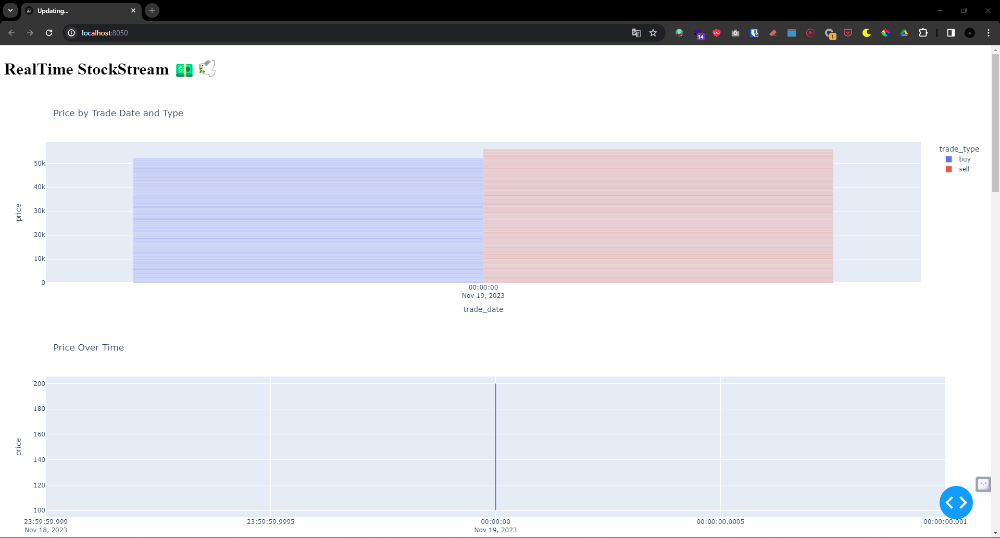


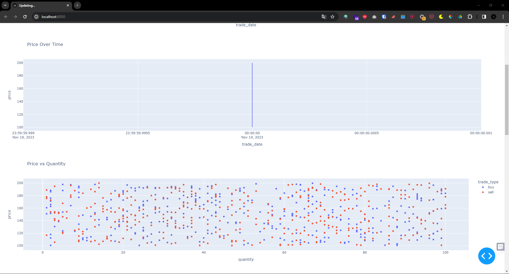


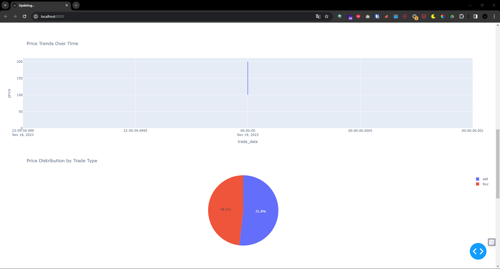


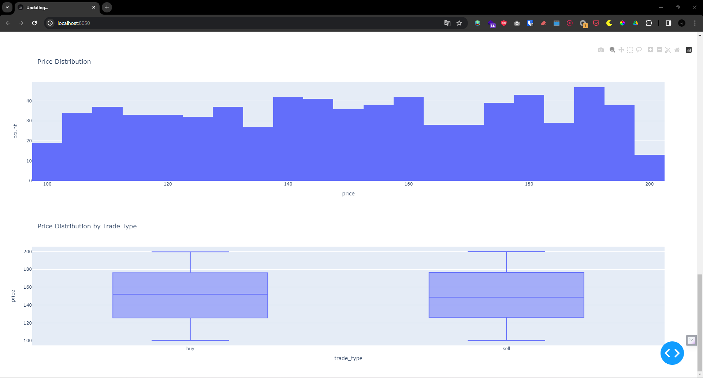

## Testing

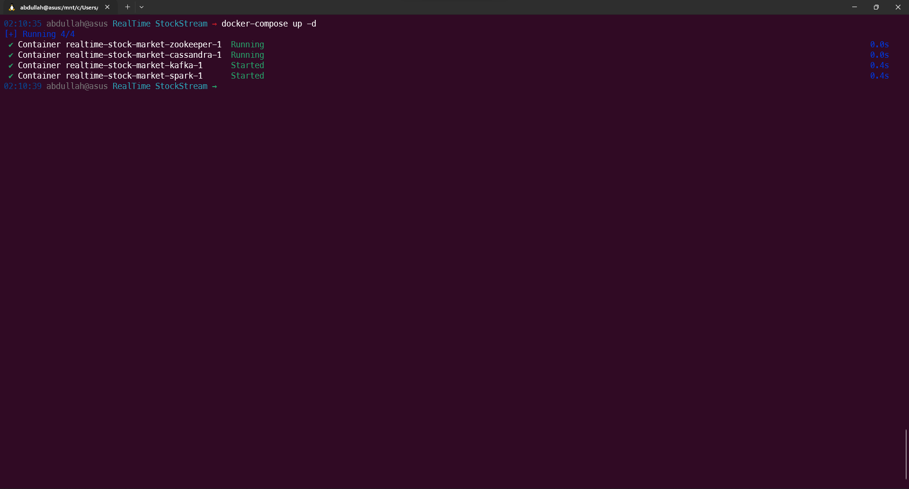

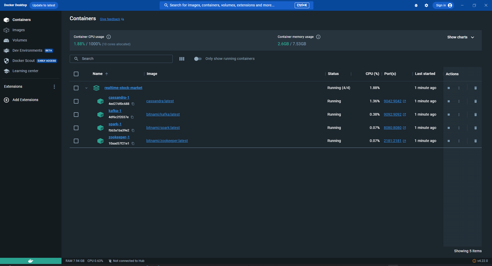

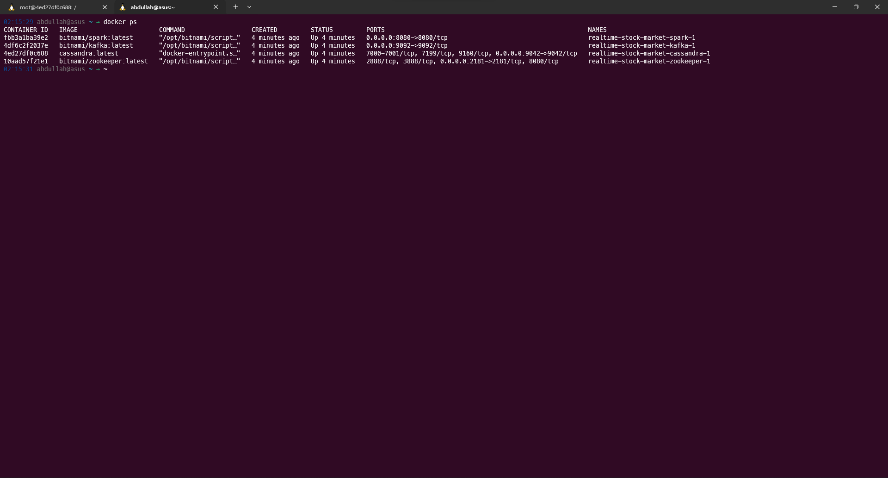

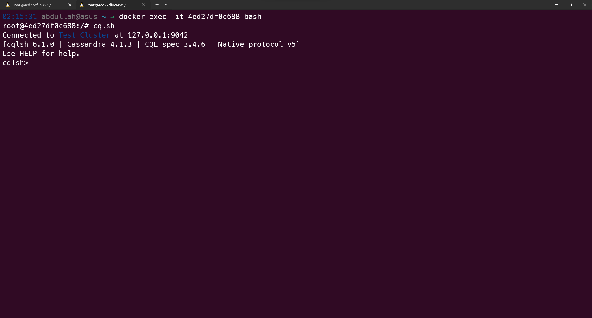

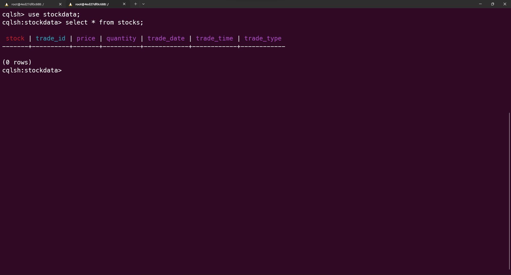

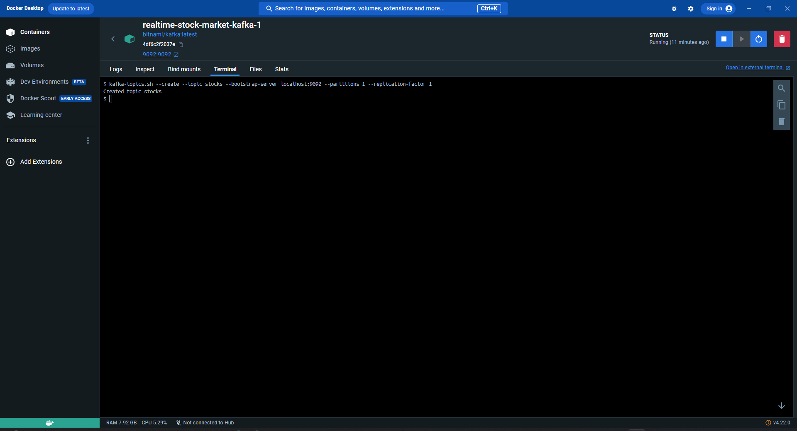

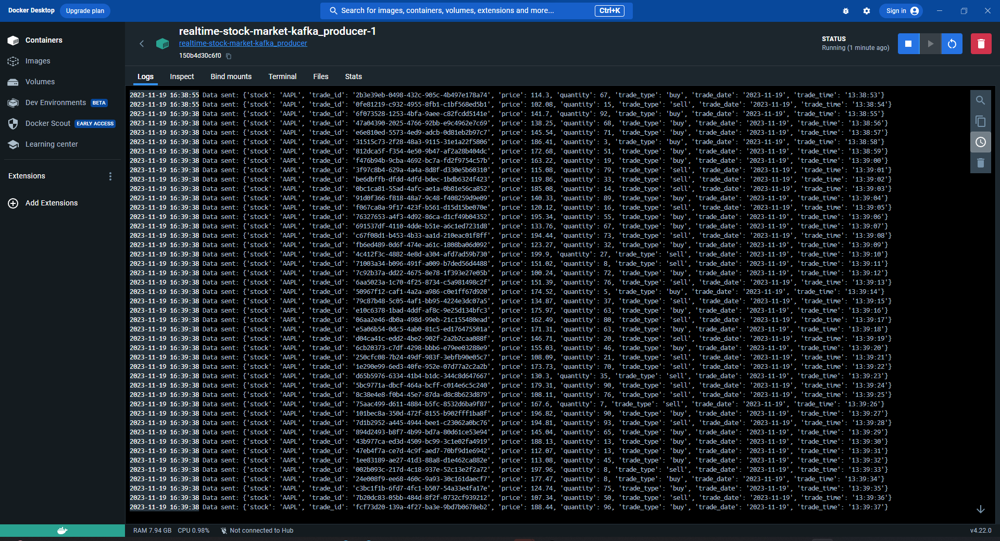

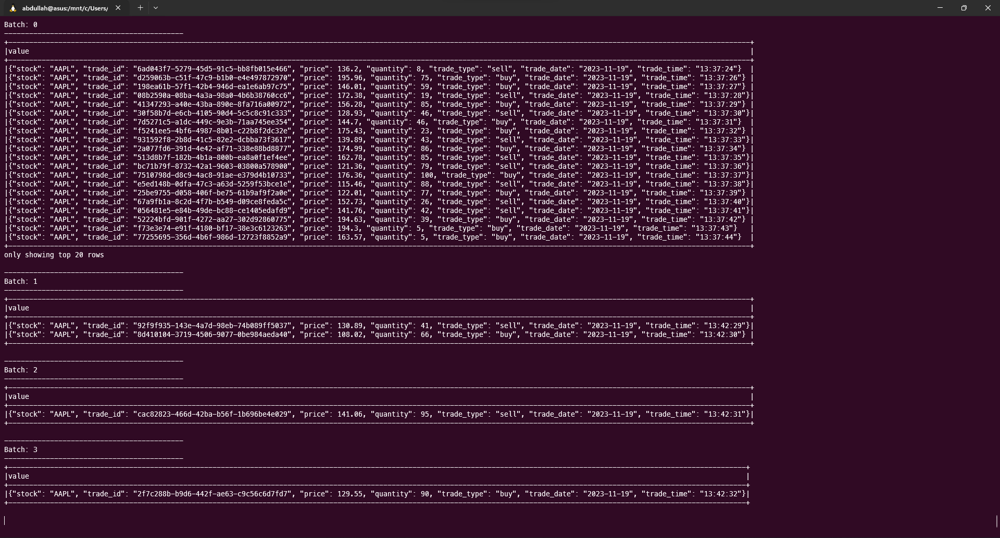

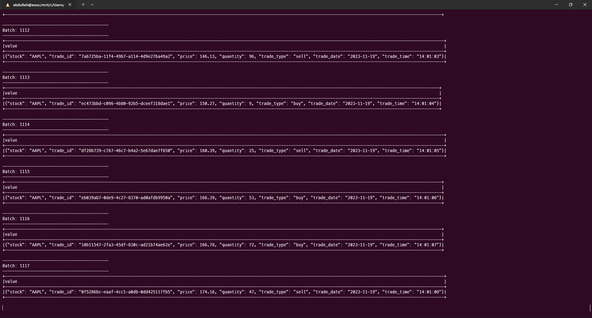

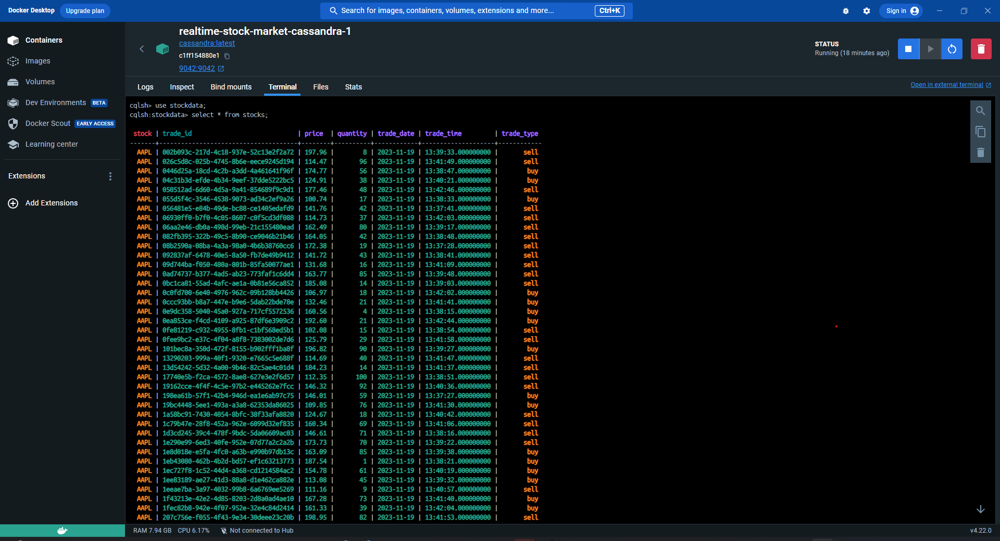

## Contributing

Contributions to RealTime StockStream are welcome.

## Authors

- [Abdullah 🚀](https://github.com/qahta0)

## License

This project is licensed under the MIT License.